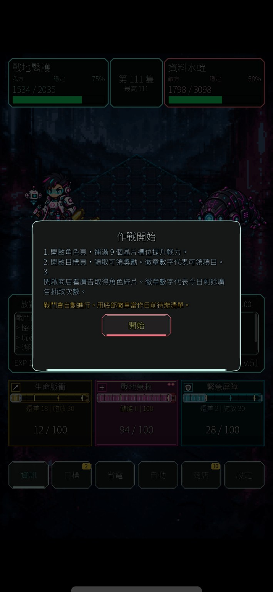
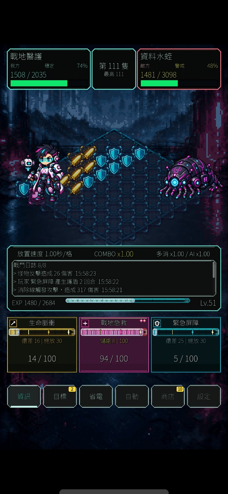
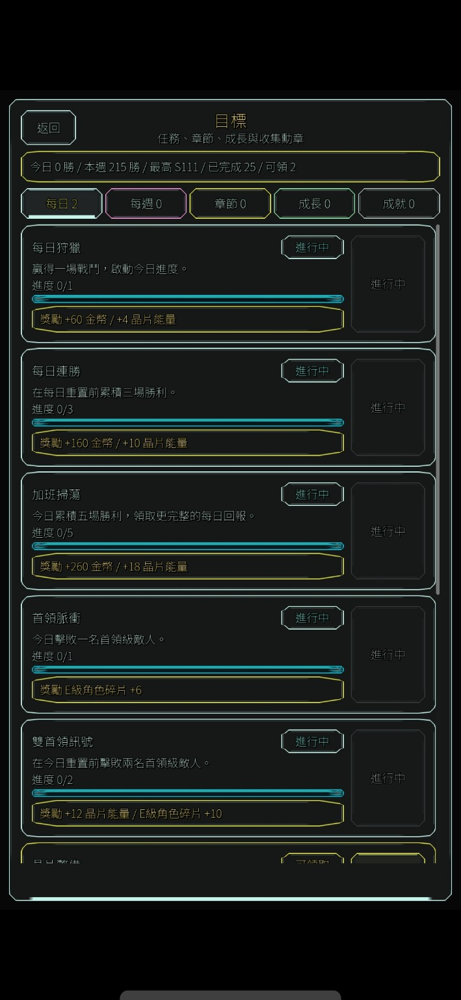
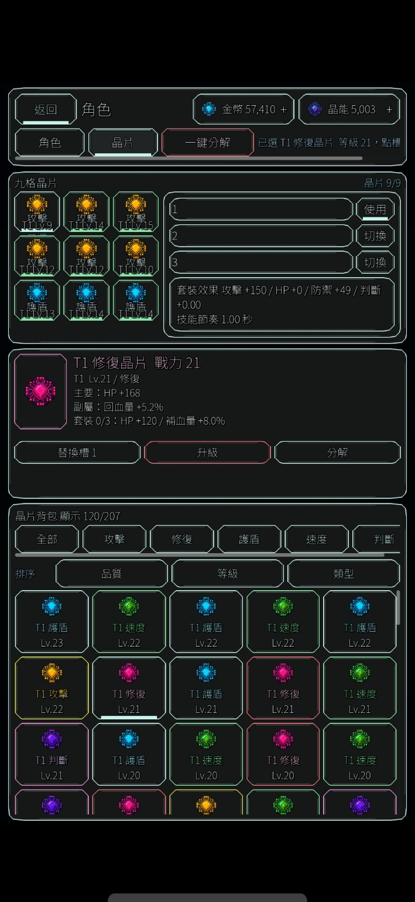
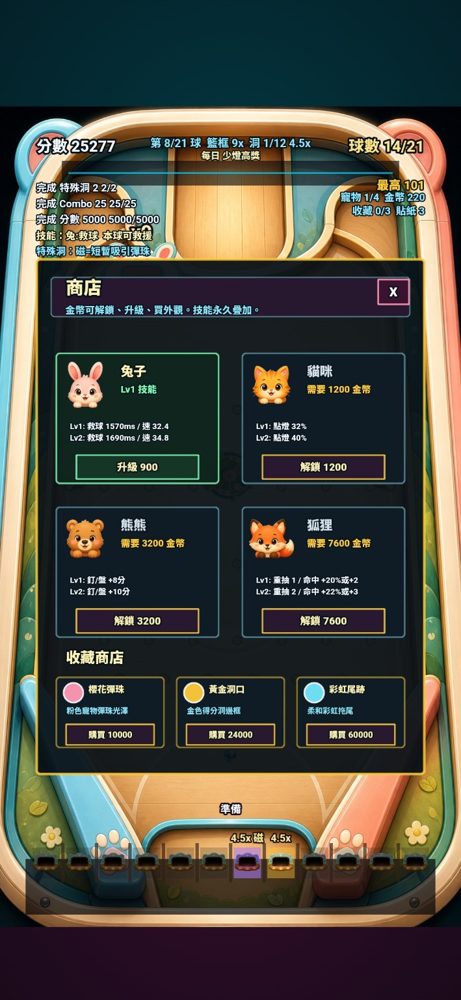
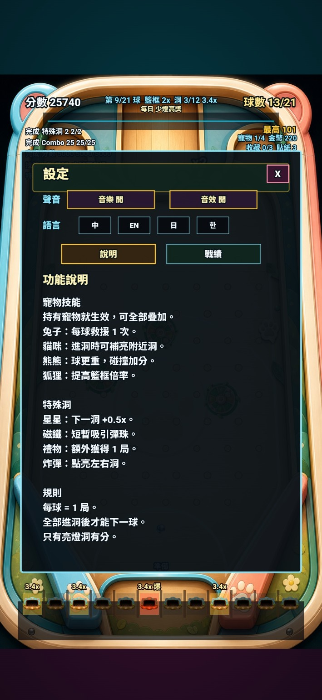

# Codex Game Studio Skill

[中文](README.md) | **English**


<!-- showcase-start -->
## Game Showcase

These three games show the kind of production work this `$gamestudio` skill is designed to support: gameplay planning, UI/HUD design, asset planning, mission systems, QA, polish, and store-readiness checks. Each game is shown separately so visitors can understand the game type and the output surface clearly.

### Taiwan Justice Street

A Taiwan-themed street action game showcase. This type of project benefits from `$gamestudio` for character planning, level pacing, game feel, mission flow, and store-readiness review.

- [Try it on Google Play](https://play.google.com/store/apps/details?id=com.dreamgame.taiwanjusticestreet&pcampaignid=web_share)
- [Gameplay video](assets/showcase/taiwan-justice-street/gameplay.mp4)

### Sequence Decipher

A sci-fi battle, auto-combat, and character progression showcase. This type of project benefits from `$gamestudio` for battle loops, character panels, mission systems, chip inventory, numeric feedback, and long-running phase handoff.

- [Try it on Google Play](https://play.google.com/store/apps/details?id=com.guangyuspace.sequencedecipher&pcampaignid=web_share)
- [Gameplay video](assets/showcase/sequence-decipher/gameplay.mp4)

<p>
  
  
  
  
  
</p>

### Bonus Hoops

A casual pachinko/basketball and multilingual UI showcase. This type of project benefits from `$gamestudio` for core-loop design, shop upgrades, pet skills, settings screens, localization, mobile layout, and QA checks.

- [Try it on Google Play](https://play.google.com/store/apps/details?id=com.bearball.bonushoops&pcampaignid=web_share)
- [Gameplay video](assets/showcase/bonus-hoops/gameplay.mp4)

<p>
  
  
</p>

Questions, feedback, or progress updates: [@sequence_decipher on Threads](https://www.threads.com/@sequence_decipher)
<!-- showcase-end -->


A Codex skill for game-development work using a compact multi-discipline studio workflow.

This skill helps Codex reason like a small game team when planning, building, testing, and polishing game projects. It is especially useful for Godot, Unity, Phaser, WebGL, 2D prototypes, gameplay systems, UI/HUD work, QA, game feel, and phase planning.

The latest version also includes long-project operating rules: finish the assigned goal in one conversation when feasible, prefer the smallest working change, maintain `CODEX_HANDOFF.md` after substantial phases, and create `DEBUG_HANDOFF.md` before further code changes when the same error survives repeated fixes.

## What It Does

When activated, the skill asks Codex to approach game work through roles such as:

- Producer: scope, milestones, risk, acceptance criteria
- Sr Game Designer: core loop, design pillars, player experience
- Mid Game Designer: feature specs, tuning, content, user stories
- Mechanics Engineer: architecture, gameplay systems, engine integration
- Game Feel Engineer: responsiveness, feedback, polish, performance
- Sr Game Artist: art direction, visual style, asset needs
- Technical Artist: shaders, particles, lighting, optimization
- UI/UX Designer: HUD, menus, accessibility, responsive layout
- QA: test plans, edge cases, regression risks, release readiness
- Market Analyst: genre expectations, competitors, audience fit
- Data Scientist: metrics, telemetry, balancing signals

It does not run multiple background agents. It gives Codex a disciplined workflow for choosing the right perspectives before acting.

It also includes game asset routing rules:

- characters, creatures, props, projectiles, FX, and animation sheets use the sprite workflow
- maps, levels, battle backgrounds, tilemaps, parallax scenes, and collision zones use the map workflow
- image generation that needs transparent extraction or chroma key should request solid green `#00FF00` first; use magenta `#FF00FF` only when green conflicts with the subject or cleanup fails

## Long Project Handoff

For long-running game projects, this skill can maintain a project-local `CODEX_HANDOFF.md` so Codex can continue after context compression or a later session.

Recommended project instruction:

```text
Keep developing this game project across phases.
Update CODEX_HANDOFF.md after each substantial task.
End every substantial response with:

【交接狀態】
- CODEX_HANDOFF.md 是否已更新：
- 本次修改檔案：
- 測試結果：
- 目前風險：
- 下一個最安全任務：
```

This is especially useful for Godot projects with many phases, scene/script changes, smoke tests, and QA passes.

## Repeated Bug Debugging

When the same error has already survived multiple attempted fixes, this skill tells Codex to stop making more code edits and first create or update `DEBUG_HANDOFF.md` with the symptom, repro steps, attempted fixes, failure reasons, root-cause hypotheses, and next validation step.

## Install

Copy this folder into your Codex skills directory:

```powershell
Copy-Item -Recurse -Force . "$env:USERPROFILE\.codex\skills\gamestudio"
```

Restart Codex after installing.

## Usage

```text
$gamestudio Help me plan the next phase of my Godot game.
```

```text
$gamestudio Review this BattlePage feature from producer, designer, engineer, and QA perspectives.
```

```text
$gamestudio Implement the next playable prototype slice, then define QA checks.
```

## Repository Layout

```text
SKILL.md
references/
  asset-routing.md
  godot.md
  handoff-debug.md
  minimal-workflow.md
  roles.md
  source-boundary.md
  templates.md
  workflows.md
```

## Attribution

This Codex skill is primarily inspired by and adapted from:

- https://github.com/pamirtuna/gamestudio-subagents

It also references and integrates workflow concepts from these open-source skills:

- https://github.com/DietrichGebert/ponytail
- https://github.com/0x0funky/agent-sprite-forge

This repository does not bundle or execute those projects' full runtimes, scripts, or assets. It summarizes game-studio, minimal-change, and sprite/map asset-routing rules into a Codex-native `gamestudio` skill. See `NOTICE.md` for attribution details.

## License

MIT License. See `LICENSE`.
